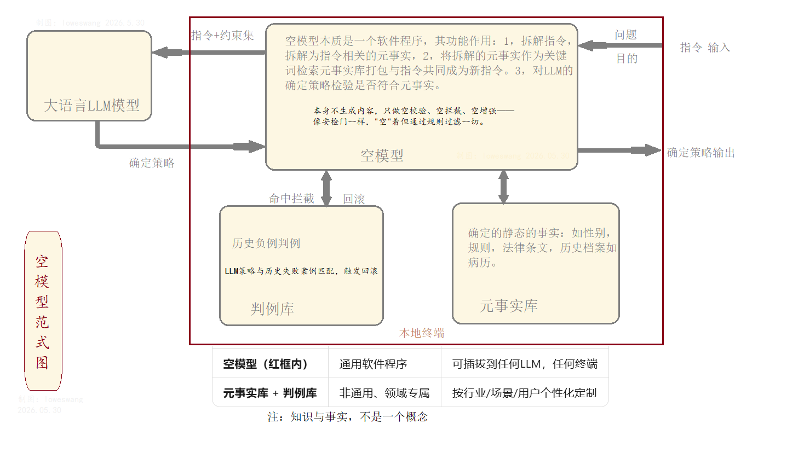

# 论安全关键人工智能系统中决策主体的形成机制

## ——*兼评当前大模型研究中的认识论盲区*

---

## 摘要

当前大模型研究将"减少幻觉"视为技术优化目标，却未追问幻觉的结构性根源。本文指出：大模型幻觉的必然性，在于其概率生成机制与"判断必须以事实为依据"这一常识的结构性背离。大模型只有公共知识的统计分布，没有绑定于具体系统的私域事实层；只有借来的、公共的、平均化的应然，没有"我是谁"的实然来锚定。本文提出TDA（Three-layer Dialectical Architecture，三层辩证架构），又称元受动极架构，其核心组件为空模型——以"空模型"承载私域事实、"结构化辩论层"构建应然-实然张力、"裁决AI"实现动态阈值下的存在论决断，从而在安全关键系统中形成可审计、可追溯的最终决策主体。本文已完成TDA核心机制的仿真验证，并提供静态事实约束与动态事实采集的参考实现及完整实验设计，期待产业界与开源社区共同推进跨场景验证。本文的核心论点是：高可靠AI的安全前提不是"模型完美"，而是在接受结构性不完美的条件下，建立"判断归机、目的归人"的主体形成机制。

**关键词**：决策主体；私域事实；概率-确定性桥接；元受动极；TDA架构；空模型范式；安全关键系统

---

## 一、问题的提出：一个被回避的基础问题

### 1.1 当前研究的盲区

2025年9月，OpenAI发表《Why Language Models Hallucinate》，系统分析了语言模型幻觉的各类技术原因，并提出若干缓解方向。该文被广泛引为"开创性工作"。

然而，该文及同类研究的共同特征是：**在"知其然"层面详尽，在"知其所以然"层面缺席**。它们分析幻觉的触发条件、统计特征、训练偏差，却未追问一个更根本的问题：

> **为什么概率生成系统必然产生幻觉？**

答案其实很简单：**因为概率不是事实，逻辑推演不是判断。**

大模型的运作机制是：在公共语料中习得词语的共现概率，在查询时输出概率最高的序列。它所做的不是"判断"，而是**在不知道事实的情况下，模拟判断的语言形式**。当事实与概率冲突时，模型服从概率；当事实缺失时，模型用概率填补空白——这就是幻觉。

### 1.2 常识的缺席

"判断必须以事实为依据"，这不是哲学命题，是常识。

- 医生诊断，依据的是病历（事实），不是医学论文的概率分布
- 法官裁判，依据的是证据（事实），不是法条的语义相似度
- 飞行员决策，依据的是仪表读数（事实），不是飞行手册的文本生成

这些事实的共同特征是：**私域的、绑定的、相对确定的、随时间可变的**。

- **私域**：我的病历，不是你的；这台设备的参数，不是那台的
- **绑定**：与具体系统、具体时刻、具体位置相关联
- **相对确定**：在判断当下是静态的，可视为"给定"
- **随时可变**：病历新增、设备更换、规则修改，必须跟踪

大模型没有这些。它有"知识"——公共的、通用的、统计的——但没有"事实"。

### 1.3 问题的紧迫性

当大模型被用于聊天、写作、创意生成时，幻觉是"可接受的不完美"。但当它被用于自动驾驶、医疗诊断、金融风控、司法辅助时，幻觉就是**结构性风险**。

当前的安全策略——RLHF对齐、Constitutional AI、护栏规则、人工审核——都在**概率层面打转**：
- RLHF对齐的是"人类偏好"，不是事实约束
- Constitutional AI约束的是"应该说什么"，不是"事实是什么"
- 护栏规则是事后过滤，不是前置约束
- 人工审核是人力兜底，不是机制保障

这些策略的共同盲区是：**未将"事实"作为独立的、不可取消的架构层**。

---

## 二、理论框架：决策主体的形成条件

### 2.1 "主体"的界定

本文不讨论"AI是否有意识"这一本体论问题。本文讨论的是**功能层面的"决策主体"**：一个系统，若其输出被作为"最终决定"采纳，则在该场景下构成决策主体。

关键问题是：**这个主体资格从何而来？**

当前实践的隐含答案是：**能力达标即授权**。模型通过测试，即被部署为决策主体。但这个逻辑回避了一个问题：**测试通过，不等于事实约束到位。**

### 2.2 判断的结构

人的判断，以"实然-应然-裁决"为结构：

| 要素 | 说明 | 例子 |
|-----|------|------|
| **实然** | "我是谁"——身份、处境、约束 | "我是收藏家""我是极简主义者" |
| **应然** | "我要什么"——价值方向、目标 | "有价值要收藏""占地方是累赘" |
| **裁决** | 在张力中的动态选择 | 要/不要 |

**核心命题：应然本身没有根基。根基是实然给的。**

没有实然，应然就是空的——不是"没有根基"，是**没有内容**。

> **例**：同一古董。
> - 实然A："我是收藏家，有仓库，有保养能力"→应然："有价值要收藏"→裁决：要
> - 实然B："我是极简主义者，住小户型，搬家频繁"→应然："占地方是累赘"→裁决：不要

**同一实然（古董存在），不同实然（我是谁），不同应然（我要什么），不同裁决。**

### 2.3 大模型的结构缺陷

| 人的判断 | 大模型的输出 |
|---------|-----------|
| 实然："我是谁"（身份、处境、约束） | **无实然**——没有身体，没有身份，没有位置 |
| 应然：从实然中生长出来 | **应然是借来的**——从训练数据中的统计偏好 |
| 裁决：扎根于"我"的决断 | **裁决是概率采样**——没有"我" |

**大模型不是没有应然，是它的应然没有锚点——不知道"我是谁"，所以"我要什么"是飘着的。**

> **例**：大模型面对古董，输出"具有历史价值，建议收藏"——这是公共知识的平均化表述，不是判断。它不知道"我是谁"，所以无法决断"我要不要"。

---

## 三、"元受动极"架构：一种主体形成机制

### 3.1 架构总览

> 
> 
> 图1：三层双视角辩证架构（TDA）流程图
> 
> 架构由输入层、空模型、能动极、受动极、结构化辩论层、元受动极层、熔断器、外挂扬弃记忆、输出层构成。区别于追求共识的多智能体，TDA将实然与应然的结构性矛盾作为系统进化动力。

### 3.2 空模型：私域事实的承载结构

> 
> 
> 图2：空模型范式图
> 
> 空模型本质是一个软件程序，其功能作用：1，拆解指令，拆解为指令相关的元事实；2，将拆解的元事实作为关键词检索元事实库打包与指令共同成为新指令；3，对LLM的确定策略检验是否符合元事实。本身不生成内容，只做空校验、空拦截、空增强——像安检门一样，"空"着但通过规则过滤一切。

| 特征 | 说明 |
|-----|------|
| **本质** | 软件程序，不是AI模型 |
| **功能1** | 拆解指令→提取相关元事实 |
| **功能2** | 元事实作为关键词检索元事实库→打包与指令共同成为新指令 |
| **功能3** | 对LLM的确定策略检验是否符合元事实 |
| **核心原则** | **本身不生成内容，只做空校验、空拦截、空增强** |
| **比喻** | 像安检门——"空"着，但通过规则过滤一切 |
| **部署** | 可插拔到任何LLM，任何终端 |
| **事实库** | 非通用、领域专属、按行业/场景/用户个性化定制 |

**关键区分**：

| | 知识 | 事实 |
|--|------|------|
| 通用性 | 通用 | **私域、绑定、定制** |
| 来源 | 公共语料 | **本地终端、用户数据** |
| 可争论性 | 可争论 | **不可争论，必须响应** |
| 空模型处理 | 不处理 | **专门处理** |

不是"知识库"。知识库是公共的、可检索的、可争论的。空模型是**绑定于具体系统的、不可争论的、作为约束条件的事实集合**。

| 知识库 | 空模型 |
|--------|--------|
| "人类正常体温约37℃" | "该患者当前体温38.5℃" |
| "青霉素可治疗细菌感染" | "该患者对青霉素过敏" |
| "古董具有收藏价值" | **"我是收藏家，有仓库"** / **"我是极简主义者，住小户型"** |

**关键区别**：空模型的事实，不是"供参考"，是**必须响应**。它回答"我是谁"，从而锚定"我要什么"。LLM的输出若与空模型冲突，进入辩论层；若辩论无法消解，熔断器介入。

### 3.3 结构化辩论层：应然-实然的张力机制

LLM的应然输出与空模型的实然约束，在辩论层形成**冲突图**：
- 节点：应然命题、实然事实
- 边：支持、反对、中立
- 权重：动态调整，基于历史先验和当前语境

辩论不是"谁说服谁"，是**让冲突显式化、结构化、可审计**。

### 3.4 裁决AI：动态阈值下的存在论决断

不是优化，是**裁决**。

| 优化 | 裁决 |
|-----|------|
| 目标函数最小化 | 约束条件下的存在论决断 |
| 可重复 | 有依据的随机（同一冲突，不同语境可能不同裁决） |
| 无责任 | 可追溯至具体阈值和历史先验 |

**动态阈值τ**：根据系统状态、历史误报/漏报、外部审计反馈，动态调整。τ不是超参数，是**系统自我维持的调节机制**。

### 3.5 非认知结构性熔断器：实然的最高否决权

不是规则引擎，不是分类器。是**存在论层面的中断**：

- 当实然约束与应然输出存在不可消解冲突时
- 当裁决AI的置信度低于动态阈值时
- 当人工审计触发最高否决权时

**熔断器直接中断输出，不经过LLM的语义消解。** 这是"实然作为最高指令"的结构化实现。

### 3.6 外挂扬弃记忆：错误的结构化丢弃

不是"微调"，不是"持续学习"。是**对错误案例的显式扬弃**：

- 误报/漏案例进入外挂记忆
- 定期审计，确认错误模式
- 更新判例库，但**不污染LLM主参数**
- LLM的"遗忘"是困难的、不可控的；外挂扬弃是**显式的、结构化的、可审计的**

### 3.7 主体形成机制

| 层级 | 功能 | 归属 |
|-----|------|------|
| 目的 | 为什么做这个判断 | **人** |
| 事实 | "我是谁"——身份、处境、约束 | **空模型（绑定系统）** |
| 裁决 | 在张力中如何选择 | **裁决AI（机器）** |
| 审计 | 对不对、能不能过 | **人+熔断器** |
| 责任 | 出事了谁负责 | **可追溯至每层** |

**"判断归机、目的归人"**：机器做判断，但判断的根基（目的+事实）来自人；机器不拥有目的，但机器的判断必须接受"我是谁"的实然硬约束。

---

## 四、与现有工作的关系

### 4.1 不是替代，是底层约束

| 现有工作 | 元受动极的定位 |
|---------|-------------|
| Scaling Law | 不改变，但接受其"结构性不完美" |
| RLHF | 不改变，但将其输出纳入应然层，接受实然约束 |
| RAG | 不改变，但RAG检索的是公共知识，空模型承载私域事实 |
| 形式化验证 | 不改变，但验证的前提从"人给规范"扩展为"系统绑定事实" |
| 人机协同 | 不改变，但协同的边界从"模糊分工"变为"目的归人、判断归机" |

### 4.2 与国内院士级范式的直接对比

本文提出的TDA架构与现有主流研究形成**互补而非替代**关系：

| 范式 | 核心贡献 | TDA的互补定位 |
|-----|---------|-------------|
| **邬江兴：内生安全（DHR多模冗余）** | 架构级容错——通过异构冗余实现"故障-安全" | **内生安全解决架构容错，TDA解决事实锚定**——冗余确保系统不崩溃，事实锚定确保系统不胡说 |
| **姚期智：可证明AGI** | 形式化验证行为边界——人给规范，机器证明 | **可证明AGI验证"是否符合规范"，TDA回答"规范从何而来"**——规范应扎根于私域事实，而非人定假设 |
| **中科院：TRC（Trusted Responsible Computing）** | 可信计算框架——从芯片到应用的全栈可信 | **TRC确保计算过程可信，TDA确保计算内容可信**——过程正确不等于内容正确 |

**核心区分**：上述范式均在"能动性"维度内优化——如何让系统更可靠、更可证明、更可信。TDA首次将"受动性"作为独立的、可形式化的架构层提出：**系统不仅需要"做得好"，更需要"被事实约束"**。

### 4.3 与OpenAI幻觉研究的对话

OpenAI的《Why Language Models Hallucinate》分析了幻觉的技术原因，提出缓解方向。本文指出：**这些缓解方向均未能触及结构性根源**。

| OpenAI的方向 | 盲区 |
|-------------|------|
| 改进训练数据 | 数据再多，也是公共的，不是私域的 |
| 增加事实核查 | 核查是事后，不是前置约束 |
| 强化对齐 | 对齐的是偏好，不是事实 |
| 多模态 grounding | grounding的是感知，不是"必须响应"的约束 |

**本文的回应**：不是让模型"更像"事实，是给模型一个**必须服从的事实层**——让它知道"我是谁"，从而锚定"我要什么"。

---

## 五、限度与诚实

### 5.1 工具化≠本体化

本文不声称该架构让AI"有意识"。本文声称的是：**该架构在功能层面模拟了"判断以事实为依据"的结构，从而在安全关键场景中形成可审计、可追溯的决策主体。**

"类意识"不是意识，是**结构的功能等价**。

### 5.2 验证的困难

| 可验证的 | 不可验证的 |
|---------|-----------|
| 空模型的事实覆盖度 | 裁决AI的"理解" |
| 熔断器的触发频率和准确率 | 系统的"主观性" |
| 判例法的收敛性 | "像不像人的判断" |
| 责任链的可追溯性 | "有没有意识" |

### 5.3 伦理前置

若该架构被采纳，需前置回答：
- 谁定义空模型的事实？（系统设计者？监管者？用户？）
- 动态阈值τ的调整权归谁？
- 熔断器误触发造成的损失，责任如何分配？

这些问题没有技术答案，是**政治问题**——必须在技术部署前回答。

---

## 六、实验验证路径设计

本文提出TDA架构的可验证性分三层推进，形成从核心机制到完整系统的渐进验证路径：

### 6.1 第一层：核心机制验证（已完成）

**目标**：验证动态阈值裁决机制的有效性

**方法**：Jigsaw Toxic Comment分类任务

**结果**：

| 方法 | 漏报率（FNR） | 误报率（FPR） |
|:---|:---|:---|
| 纯模型A（Baseline） | 31.22% | 3.11% |
| 固定阈值 τ=0.5 | 5.41% | 18.22% |
| 固定阈值 τ=0.7 | 10.17% | 9.84% |
| 固定阈值 τ=0.9 | 20.15% | 4.27% |
| **TDA（动态阈值）** | **6.73%** | **6.98%** |

**结论**：动态阈值依托判例库实现场景差异化松紧调节，同步压低漏报、误报，突破固定阈值安全-可用性互斥困境。

### 6.2 第二层：静态事实约束验证（参考实现已开源）

**目标**：验证私域事实检索+冲突拦截机制

**参考实现**：nmp.py（Null Model Paradigm）

**核心流程**：
- 输入问题→空模型检索相关事实→打包为JSON→LLM在事实边界内生成→冲突校验→放行/拦截

**验证要点**：
- 事实召回率：检索相关事实的完整性
- 冲突检测命中率：拦截与事实矛盾输出的准确率
- 误拦截率：合法输出被错误拦截的比例

**开源状态**：代码已开源，社区可复现扩展。限于个人研究者资源，大规模跨领域定量评估待产业界支持。

### 6.3 第三层：动态事实采集验证（实验设计已完成，待执行）

**目标**：验证动态私域事实采集+闭环修复的完整可行性

**参考实现**：crash_probe.py（定向故障探针）

**场景设计**：系统运维故障诊断

**对比框架**：

| | 旧范式（纯LLM） | 新范式（TDA） |
|--|---------------|-------------|
| 用户输入 | "游戏一直崩溃" | "游戏一直崩溃" |
| 系统响应 | 列出5个猜测（驱动、DX、过热、显存、系统文件） | **启动探针采集私域事实** |
| 事实采集 | 无 | GPU状态、进程日志、崩溃转储、硬件配置 |
| LLM分析基础 | 公共知识概率分布 | **结构化事实报告** |
| 诊断输出 | 泛泛而谈，用户反复尝试 | 根本原因定位+针对性修复建议 |
| 闭环验证 | 无 | 修复→稳定性验证 |

**预期指标**：
- 诊断准确率（根因定位正确率）
- 用户尝试次数（旧范式平均尝试次数 vs 新范式一次性解决率）
- 闭环修复成功率（建议应用后问题解决率）

**资源需求**：跨硬件平台的崩溃案例库、多版本驱动兼容性测试环境，超出个人研究者能力边界。

**当前状态**：实验设计已完成，参考实现（crash_probe.py）可运行，完整定量验证待产业算力与开源社区共同推进。

### 6.4 跨场景一致性声明

上述三层分别验证：
- **第一层**：裁决机制（动态阈值优于静态阈值）
- **第二层**：静态事实层（私域事实约束开放生成）
- **第三层**：动态事实层（实时状态采集驱动闭环修复）

三层组合构成TDA完整验证链条，但每层可独立评估。本研究已完成第一层，提供第二、三层的参考实现与实验设计，证明TDA架构从核心机制到工程落地的可行性路径。

---

## 七、产业落地指向

该架构可优先在以下场景开展试点：

| 场景 | 私域事实特征 | 责任边界敏感度 |
|-----|-----------|-------------|
| **金融信贷合规** | 客户征信、资产负债表、监管规则 | 高——误判导致坏账或合规处罚 |
| **自动驾驶高精地图校验** | 实时路况、车辆传感器参数、地图版本 | 极高——误判直接危及生命安全 |
| **医疗电子病历审核** | 患者病史、过敏记录、用药禁忌 | 极高——误判导致医疗事故 |
| **司法辅助裁判** | 案件证据、当事人信息、适用法律 | 高——误判影响司法公正 |

**共同特征**：私域事实明确、责任边界敏感、现有大模型幻觉风险不可接受。

---

## 八、结论

大模型幻觉的根本原因，不是训练不足、数据不够、对齐不强，是**结构性缺失：没有私域事实层，没有"我是谁"的实然来锚定应然，没有实然作为最高指令的裁决结构。**

当前安全策略在概率层面打转，是**用技术复杂性掩盖认识论简单性**。

"元受动极"架构的提出，不是否定现有技术路线，是**在现有路线之下，建立一个不可绕过的约束层**——让"判断必须以事实为依据"这一常识，成为AI系统的结构性前提。

高可靠AI的安全前提，不是"模型完美"，是**在承认模型不完美的条件下，建立"判断归机、目的归人"的主体形成机制**。

---

## 参考文献

[1] OpenAI. Why Language Models Hallucinate. arXiv:2509.04664, 2025.

[2] Maturana, H. R., & Varela, F. J. Autopoiesis and Cognition. Reidel, 1980.

[3] Spinoza, B. Ethics. 1677. (Conatus doctrine)

[4] Heidegger, M. Being and Time. 1927. (Dasein as thrown projection)

[5] Husserl, E. Ideas Pertaining to a Pure Phenomenology. 1913. (Intentionality)

[6] Friston, K. The free-energy principle: a unified brain theory? Nature Reviews Neuroscience, 2010.

[7] Blum, M., et al. Conscious Turing Machine. arXiv:2107.13704, 2021.

[8] 邬江兴. 内生安全与拟态防御. 中国科学: 信息科学, 2018.

[9] Yao, A. C. C. 可证明安全的通用人工智能. 相关学术报告, 2023-2024.

[10] 中国科学院. 可信计算与负责任计算（TRC）框架. 相关技术白皮书, 2024.

---

